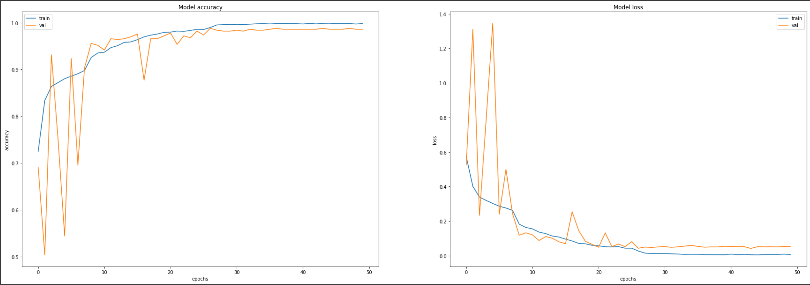

Greetings Everyone.

This is my First Repository on Github.

For my first time, i decided to train a Dense Net 121 model (with a few extra Dense layers with Dropout) to classify CT scan images as belonging to the "Covid" or "Non_Covid" category. I trained my model on the publicly available Sars-Cov-2 Ct scan dataset (Link for the same available inside model training notebook).

I have also developed my first API using the Fast API framework. This API has two main endpoints: One which simply accepts a CT scan image and returns its class i.e. it's category, Second endpoint can be used to evaluate the model wholly as it returns all the imperative metrics of the model such as precision, recall, etc. Note: a test folder link is there (This folder was not used during training or evaluation of the model) which could be used for the purpose of evaluation. One can also use a custom dataset for the same, only constraint being that it should follow a certain format - inside the root folder, there should be two directories namely "COVID" and "NON_COVID" with their respective images inside of it.

Model Stats (Model loss and accuracy on the train and val set):

More Info about Model training can be found inside the notebook called "Model_training.ipynb"

https://drive.google.com/drive/folders/1UNNpvKAwHEFK5qomQix542QACw6cJ6Qc?usp=sharing : This has the model weights along with the additional test set folder.

Now, Steps to follow in order to host the API on your local computer/laptop: (Note all these commands need to be executed on a terminal/cmd)
1. Change the path to the project directory. (eg: cd <path of the project directory>)

1. Create a virtual environment so that you can download all the required packages.

eg: python -m venv <name of the virtual environment>

2. Activate the environment using the command: <name of the virtual environment>\Scripts\activate.bat

3. Download the necessary packages inside it with "pip install -r requirements.txt"

4. Once, all the packages are downloaded, we can move on to hosting the api.

5.We will start the api using the command: uvicorn my_api:app --reload (Note: reload argument is useful when you would also want to make changes to the script. That way you won't have to restart the api, just save the file and it will automatically reload)

6. Once we run the command, we will get the link to our locally hosted api, which can be copy pasted into the url section of your web browser.

7. Now, we have two options to access the api:
a. By pasting the url and adding '/docs' to the end. This will open a neat documentation from where the endpoints/methods can be accessed easily.
b. By using our script "api_parser.py".

Optional steps to follow if one wants to use the python script to access the api:
1. Open another terminal and write the command: python api_parser.py --choice a
(Note open a new terminal and activate the virtual environment again before running the python script)
Note: we have two options here "a" and "b"

Option a: If you want to get an image or few images classified, this will be a good option. This option will create a new folder named "Custom" along with sub directories "Covid" and "non-Covid" and save the images in the respective folder based on how the model classifies them.

Option b: If you want to comprehend the overall performance of the model i.e. look at its evaluation metrics, this option will help you for that.
Note: You can either use the test set (Link for the same is present above) or can use your custom dataset with one caveat - You need to make sure that inside the base directory, you have two folders named "COVID" and "NON_COVID" with their corresponding CT scan images.

2. if Option a is set in the --choice argument, you need to provide the image path or folder path, and they will get saved in the custom folder accordingly.

3. If Option b is set in the --choice argument, you need to provide the path to the base folder which has two sub folders inside named "COVID" and "NON_COVID".
